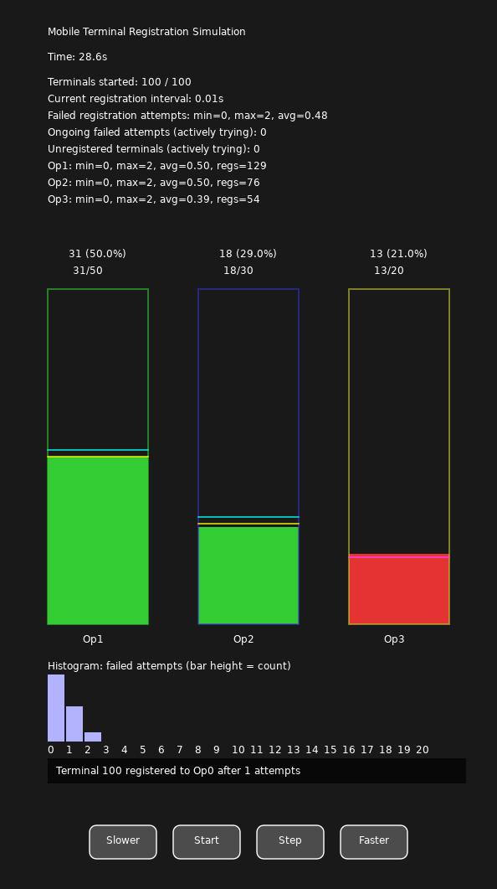

# Mobile Terminal Registration Simulation

A simulation of mobile terminal registration and operator distribution, built with [LÖVE2D](https://love2d.org/). This project visualizes operator registration logic, hysteresis, and statistics for a configurable number of terminals and operators.

## Features
- Operator registration with configurable distribution and hysteresis (gap_up, gap_down)
- Visualization of operator bar states (open/closed) and registration results
- Metrics for registration attempts (min, max, avg), per-operator statistics, and a histogram of failed attempts
- Interactive UI controls: Pause/Start, Step, Slower, Faster
- Responsive layout, clear and non-overlapping UI
- Modular MVC code structure (`model.lua`, `view.lua`, `controller.lua`, `terminal.lua`)



## Requirements
- [LÖVE2D](https://love2d.org/) (tested with 11.x)

## Usage
1. Install LÖVE2D for your platform ([Download here](https://love2d.org/#download)).
2. Clone this repository:
   ```bash
   git clone https://github.com/YOUR_GITHUB_USERNAME/simulate_gisteresis.git
   cd simulate_gisteresis
   ```
3. Run the simulation:
   ```bash
   love .
   ```

## Development Notes
- **Total development time:** 4 hours 20 minutes (from first prototype to final, modular, documented application)
- **AI-assisted coding:** This project was developed using the [Cursor](https://www.cursor.so/) code editor and AI code assistant (OpenAI GPT-4). The AI module was used for code generation, refactoring, and design suggestions throughout the development process.
- **For students and educators:**
  - AI coding tools can greatly speed up development and help with structure, refactoring, and bug fixing.
  - **However, human review is still essential**—some mistakes and bugs will not be discovered without a developer carefully reviewing the code and understanding the logic.
  - Developers still need to know the programming language, the tools, and have relevant scientific or domain knowledge to create robust applications.
- **Note:** With traditional development workflows, a project of this scope would typically require 1–2 days of focused work. Using AI-assisted coding and modern tools, the total active development time was reduced to just over 4 hours.

## License
This project is licensed under the [Apache License 2.0](LICENSE).

---

© 2024 AlexBurnes<AlexBurnes@gmail.com>. See [LICENSE](LICENSE) for details. 